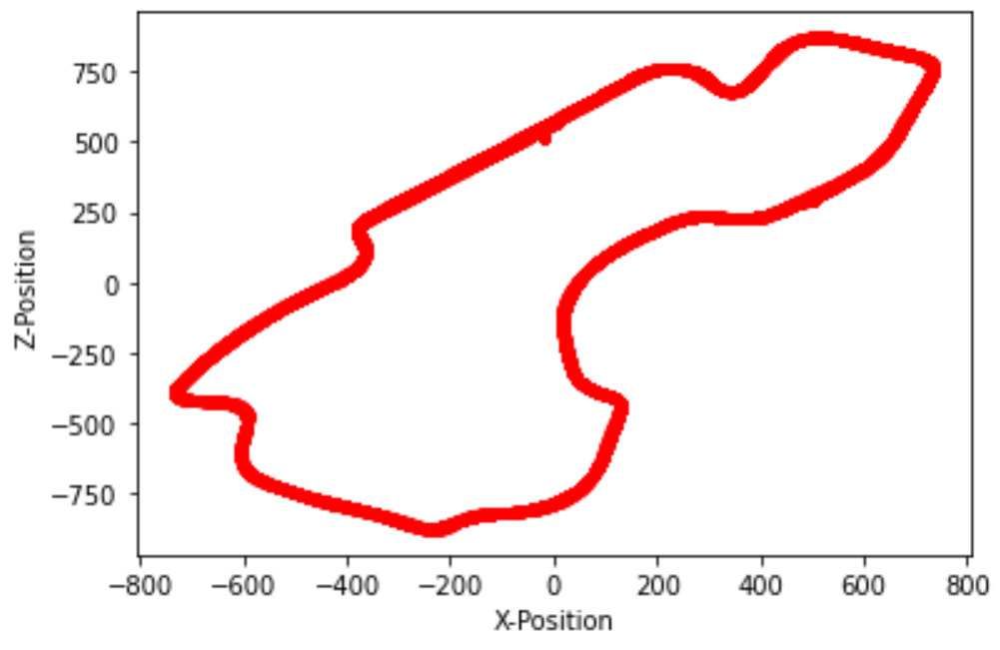
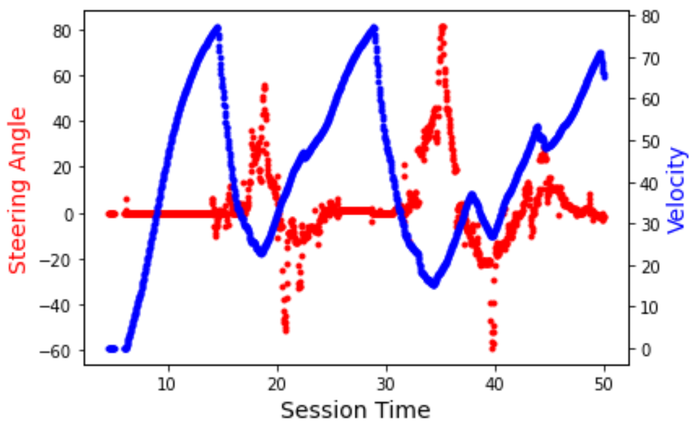

# UDP Packet Information

The data scraped from the F1 racing simulator is in the form of a UDP packet. Details on the structure and contents of the packets can be found [here](https://forums.codemasters.com/topic/30601-f1-2018-udp-specification/). The [data_scraper.py](data_scraper.py) module extracts this data and stores it in a python dictionary for easy lookup by session time, and then serializes the dictionary as a pickle file for storage. The structure of the data is as follows.
 
|           |             |       |       |       |        |        |        |         |         |          |          |           |          |
|    -      |      -      |   :-:   |   :-:   |   :-:   |   :-:    |   :-:    |    :-:  |    :-:    |    :-:    |     :-:    |     :-:    |     :-:     |     :-:   |
| **Index** |  Key        | 0     | 1     | 2     | 3      | 4      | 5      | 6       | 7       | 8        | 9        | 10        | 11       |
| **Data**  | Session Time | X Position | Y Position | Z Position | X Velocity | Y Velocity | Z Velocity | X Forward Direction | Y Forward Direction | Z Forward Direction | X Right Direction | Y Right Direction | Z Right Direction |
  
  Given that there are 20 cars on the track during each race, the overall shape of the array at a given session time is (20,12).
  
  The [visualize.py](visualize.py) module provides two methods for visualizing the extracted UDP data. The `plot_position_data` method plots the position of all cars on the (X,Z) plane (where Y represents elevation). Viewing this graph is a good indicator as to what the shape of the racetrack looks like. An example plot of the Australia Park Grand Prix Circuit is shown below.
 

  
  The `plot_steering_velocity` method plots the magnitude of the ego vehicle's velocity and the steering angle as a function of time for the first 50 seconds of the race. An example plot is shown below.
  

